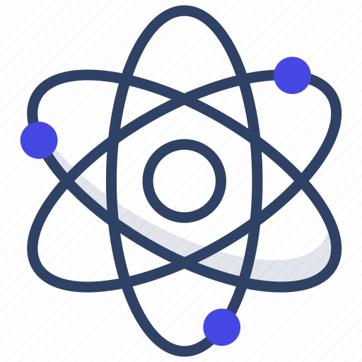

<p align="center">
  
</p>

# Proton CLI
A CLI for Proton Framework.

## Customizing your CLI

Check out the documentation at https://github.com/infinitered/gluegun/tree/master/docs.

## Publishing to NPM

To package your CLI up for NPM, do this:

```shell
$ npm login
$ npm whoami
$ npm lint
$ npm test
(if typescript, run `npm run build` here)
$ npm publish
```

# License

MIT - see LICENSE

